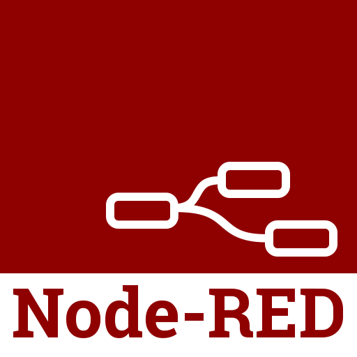

<h1>Hi, I'm HyeRim</h1>

- 💻 I am a Frontend developer
- 💙 I love exploring new tech stack and leveraging them to build cool stuffs
- 🌱 I’m currently learning TypeScript and Webpack
- 📝 Ask me anything on my issues page
- 📧 Connect with me on [instagram](https://instagram.com/dv_hroo)

 
<table width="100%">
    <tr>
        <td colspan="2" align="center">
            <h4><code>Tech Tools</code></h4>
        </td>
    </tr>
    <tr>
    	<td align="center">
            <code><b>Frontend</b></code>
        </td>
        <td align="center">
            

                <code></code>
                <code></code>
                <code></code>
                <code></code>
                <code></code>
                <code></code>
                <code></code>
                <code></code>
            

        </td>
    </tr>
    <tr>
        <td align="center">
            <code><b>others</b></code>
        </td>
        <td align="center">
            

                <code></code>
                <code></code>
                <code></code>
                <code></code>
            

        </td>
    </tr>
</table>

 

<table width="100%">
    <tr>
        <td colspan="3" align="center">
            <h4><code>Projects</code></h4>
        </td>
    </tr>
    <tr>
        <td>
            </img>
        </td>
    	<td align="center">
            <a href="https://github.com/hrookim/U-R-IN">
            <code><b>U R IN</b></code>
            </a>
        </td>
        <td>
            <ul>
                <li>
                삼성청년SW아카데미 7기 공통프로젝트
                </li>
                <li>
                AI분석 면접스터디 플랫폼
                </li>
            </ul>
        </td>
    </tr>
    <tr>
        <td>
            </img>
        </td>
        <td align="center">
            <a href="https://github.com/SoopSASM/SamsungAutomationStudio">
            <code><b>Dashboard node</b></code>
            </a>
        </td>
        <td>
            <ul>
                <li>
                삼성청년SW아카데미 7기 삼성전자연계(SSDC)프로젝트
                </li>
                <li>
                SmartThings 기기를 활용한 Node-RED 오픈소스 대시보드
                </li>
            </ul>
        </td>
    </tr>
    <tr>
        <td>
            </img>
        </td>
        <td align="center">
            <a href="https://github.com/MEEPLO/MEEPLO">
            <code><b>Meeplo</b></code>
            </a>
        </td>
        <td>
            <ul>
                <li>
                삼성청년SW아카데미 7기 자율프로젝트
                </li>
                <li>
                어디서 만날지 추천받고, 함께한 기록을 남길 수 있는 애플리케이션
                </li>
            </ul>
        </td>
    </tr>
</table>

 
